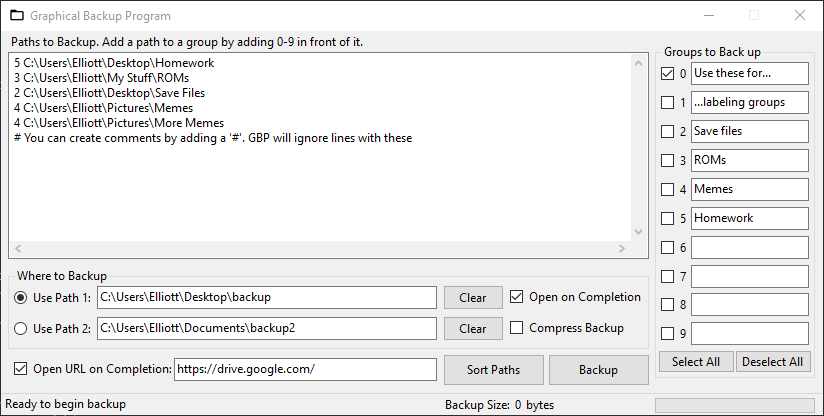

# Graphical-Backup-Program
## What is GBP? 🤔
On my main PC, I like to run a full PC backup occasionally. In addition, I like to back up my "super important" folders to an external location like Google Drive. Things like video game save files, etc. I like to have extra backups of super important stuff like this. It is also nice if I need these files on another PC, I can grab them from the cloud easily. I used to have to do this manually, hunting down every folder and file on my PC. But now, I just push a button, and they're all copied to a folder and opened automatically.

Graphical Backup Program (GBP) is a significantly improved version of [Folder Copy (FC)](https://github.com/ellman12/Folder-Copy). FC was pretty bad, but it got the job done. FC also had a lot of dumb: It was a command line tool, I went with Python as the language, and it could only backup folders. My original plan was to modify FC to be able to do files, but I put that off for a while, and eventually decided to create a whole new project with a GUI. It was originally going to be called FC2 (terrible name). Eventually, I came up with Graphical Backup Program (GBP), which I think is a much better (albeit fairly generic) name. A program called Folder Copy that can do both doesn't really make much sense.

One night, I was getting ready to go to bed, and for some reason I just started to do some serious thinking about FC2 (that was still what I was going to call it at the time). I got out the pen and paper and started drawing out the GUI and how I wanted it to work, and most, if not all of my ideas from that night ended up in the final product. I'm still amazed at how I just came up with all the ideas for it in like 1 night.

I am extremely happy with how well GBP turned out. C# was definitely the way to go with this project. I am also very satisfied with how the GUI looks. Considering I am usually terrible at UI design, I think this GUI turned out real nice.

One nice thing about GBP is that it saves the items you want backed up to a file so you don't have to re-enter it each time you run a backup. It also has a config file that stores which options you checked, etc. in the GUI so that the next time you open it, it's ready to go. These are both stored in the project directory, and if they don't exist, it automatically creates them on startup.

## Returning Features From Folder Copy
* Backup folders (obviously)
* Ability to clear the backup folder before backing up to prevent old, unnecessary backups from consuming disk space
* Opens backup folder in File Explorer when backup completed. This allows you easy access to the folder for backing up to Google Drive or some other service, without having to go hunting for it each time.
* Copy folders into a folder with a timestamp as its name so you can keep track of when you have made backups.

## New and Improved in Graphical Backup Program
* Easy-to-use GUI: No crappy command line "interface" here!
* Ability to backup files now
* Easily switch between 2 different backup locations (or do 2 backups at the same time)
* Ability to back up only common items that frequently change: mark items as common or uncommon. E.g., a video game save file would change often, but a ROM file wouldn't.
* GBP's log/output is a lot better than FC's
* GBP performs significantly faster than FC, even when copying large folders (just be warned, if you throw large folders at GBP, it will massively slow down your PC and GBP will act like it is frozen, but it's not. Just be patient.)

GBP icon from [Google Material Icons](https://fonts.google.com/icons?selected=Material%20Icons%20Outlined%3Afolder_open)

## How to Install
Setting up GBP should be pretty simple and straightforward. Just download the Program.zip from [GitHub](https://github.com/ellman12/Graphical-Backup-Program/releases/tag/v1.0), extract it to somewhere appropriate like <code>C:\Program Files\GBP</code> and you should be good to go. If it's the first time running it, GBP should automatically create the 2 files it needs.

## How to Use
GBP is designed to be easy-to-use and easy to setup. The GUI should be sufficiently idiot-proof, and all the options should speak for themselves, but I will explain them a little more in-depth here.

This is the GBP GUI. In-depth explanations of the GUI: 
1. This is where you enter the paths to the files and folders that you want backed up. Marking a path as common ('c') tells GBP that this is an item that constantly changes; marking one as uncommon ('u') tells GBP that this item doesn't change as much as a common one does, and if you choose to backup just common paths, any items marked as 'u' will be ignored.
Case doesn't matter: you can enter 'c' or 'C'.

2. This button will backup any paths marked as 'c' and 'u'.

3. This button will backup just the items marked as 'c'.

4. After a backup is finished, press this button to get GBP ready for another backup (if you want to. If you are done, you can just close the GUI). Pressing this button will clear the log, and put the paths you previously entered back into their TextBox.

5. This GroupBox controls where the paths entered above are backed up. Checking a box tells GBP to copy all the paths there. If it's not checked, it won't use it (even if the TextBox isn't empty). If you want to create 2 backups, or switch between backup locations, you can do that with this. You can also clear a TextBox with a push of the 'Clear' button. If you want to open this folder in File Explorer when the backup finishes, check the 'Open on Completion' box.

6. GBP has the ability to clear path1 and path2 before the backup begins. If you use the same folder for backups over and over again, this can be handy to remove old backups you no longer need. It can be done completely automatically without a prompt, or with a yes-or-no prompt asking if you want to clear the folder(s). Can also be totally disabled by checking the 3rd button, which won't remove anything.

7. This enables/disables GBP copying everything into a folder with a timestamp as its name. This can be useful for keeping track of when your last backup was. I reconmend turning this setting on.

8. If instead of copying all the items, you instead want them opened in File Explorer, you can also do that with GBP.

9. This is mainly for debugging/testing purposes, but if at any point you want to save the config values and paths to their files, you can do that with this button.

## Contributing
Feel free to open a PR or shoot me a message if you have ideas for GBP or you spot a bug 🐛.